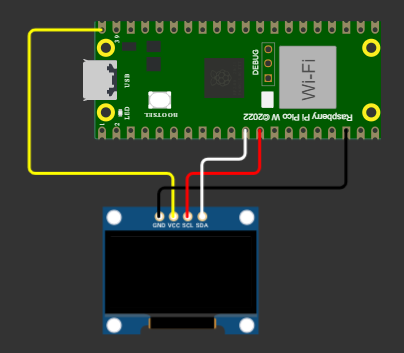
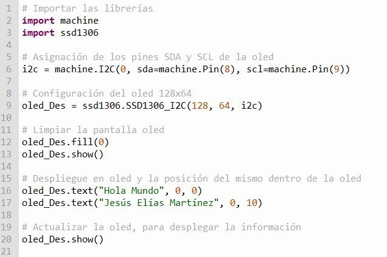
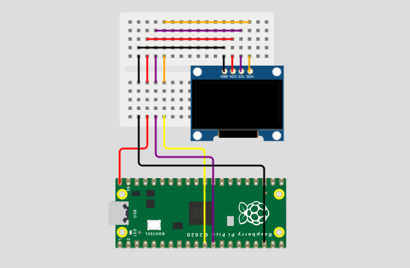

# 2.1 Practica Hola Mundo y la Hora de Internet (NTP Time server) 
Depto de Sistemas y Computación  
Ing. En Sistemas Computacionales  
SISTEMAS PROGRAMABLES 23a  
Autor: Jesús Elías Martínez  
Fecha de entrega:   12/10/2023  
Objetivo: Investigar y prácticar la maniuplación de la raspberry pico W con la pantalla oled e internet  

## 2.1.1 Práctica de inicio desplegar algo en pantalla oled
**Modelado en wokwi**  
  

**Conexiones (en físico)**  

**Código de thonny**   
  

**Resultados**

## 2.1.2 Desplegar la hora de internet (Servidor NTP) en pantalla oled
**Modelado en wokwi**  
  

**Conexiones (en físico)**  

**Código de thonny**   

**Resultados**
