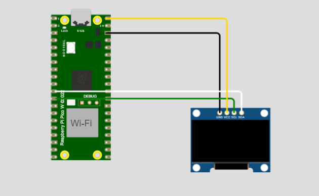

# 2.1 Practica Hola Mundo y la Hora de Internet (NTP Time server) 
Depto de Sistemas y Computación  
Ing. En Sistemas Computacionales  
SISTEMAS PROGRAMABLES 23a  
Autor: Jesús Elías Martínez  
Fecha de entrega:   12/10/2023  
Objetivo: Investigar y prácticar la maniuplación de la raspberry pico W con la pantalla oled e internet  

## 2.1.1 Práctica de inicio desplegar algo en pantalla oled
**Modelado en wokwi**  
  

**Conexiones (en físico)**  

**Código de thonny**   
```
# Importar las librerías
import machine
import ssd1306

# Asignación de los pines SDA y SCL de la oled
i2c = machine.I2C(0, sda=machine.Pin(8), scl=machine.Pin(9))

# Configuración del oled 128x64
oled_Des = ssd1306.SSD1306_I2C(128, 64, i2c)

# Limpiar la pantalla oled
oled_Des.fill(0)
oled_Des.show()

# Despliegue en oled y la posición del mismo dentro de la oled
oled_Des.text("Hola Mundo", 0, 0)
oled_Des.text("Jesús Elías Martínez", 0, 10)

# Actualizar la oled, para desplegar la información
oled_Des.show()
```

**Resultados**

## 2.1.2 Desplegar la hora de internet (Servidor NTP) en pantalla oled
**Modelado en wokwi**  
  

**Conexiones (en físico)**  

**Código de thonny**   

**Resultados**
